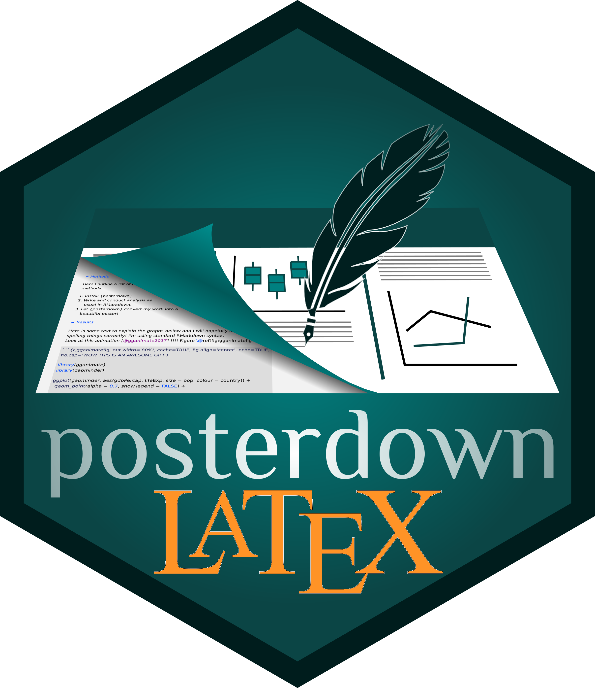
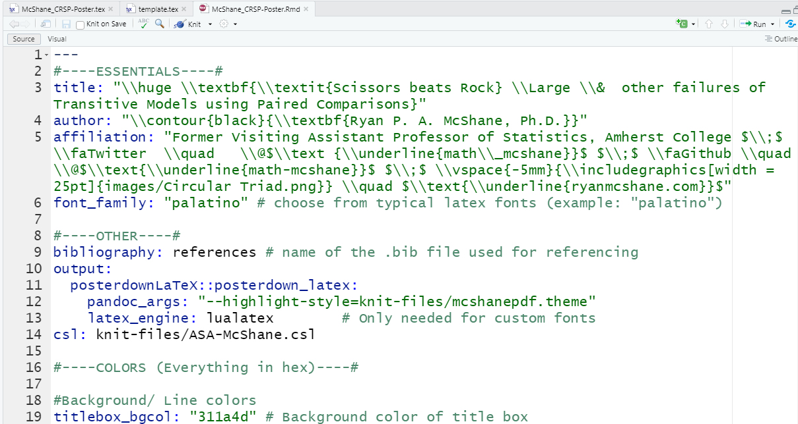
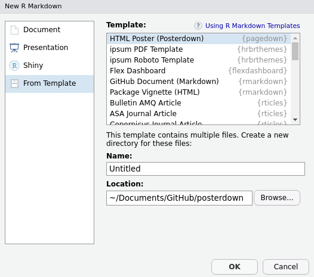

# posterdown

<!-- badges: start -->
[](https://www.tidyverse.org/lifecycle/#experimental)
[](https://travis-ci.com/math-mcshane/posterdown)
<!-- badges: end -->



>**Currently undergoing major changes. Note that every YAML parameter currently requires an input for you to successfully knit.** 


### Support

_You can follow me (Ryan McShane) on [twitter](twitter.com/math_mcshane) for upcoming features as well as to keep up with my work in academia._

## Why posterdownLaTeX

Brent Thorne uploaded `posterdown` to CRAN and left the LaTeX support in the dust. I wanted to make a poster in R Markdown built on a LaTeX format. If you want an `html` poster (which *can* be converted to .pdf after knitting), I suggest using the CRAN version of `posterdown`. 

From this:



To this:


Please feel free to give me feedback or requests for changes in the [issues](https://github.com/math-mcshane/posterdownLaTeX/issues) page.  

#### Citation

To cite `posterdownLaTeX` in publications, use:

`Ryan P. A. McShane (2022). posterdownLaTeX: An R Package Built to Generate Reproducible Conference Posters for the Academic and Professional World Where Powerpoint and Pages Just Won't Cut It. R package version 0.1.1`

A BibTeX entry for LaTeX users is:

```
  @Manual{posterdownLaTeX,
    title = {posterdownLaTeX: An R Package Built to Generate Reproducible Conference Posters for the Academic and Professional World Where Powerpoint and Pages Just Won't Cut It},
    author = {Ryan P. A. McShane},
    year = {2022},
    url = {https://github.com/math-mcshane/posterdownLaTeX},
    note = {R package version 0.1.1},
  }
```
## Installation

You can install and use **posterdownLaTeX** from github using the `devtools` package as seen below.

```r

devtools::install_github("math-mcshane/posterdownLaTeX")

```

### Instructions if you have never used RMarkdown

1. Install `devtools` package

```r
install.packages("devtools")
```

2. Install `posterdownLaTeX` from github repo

```r
devtools::install_github("math-mcshane/posterdownLaTeX")
```

3. Install `tinytex`Latex libraries:

```r
tinytex::install_tinytex()
```

 > _**NOTE:** This will take some time to load the LaTex Packages but is the best option (in my opinion) for keeping your Latex library as small as possible. You will only need to do this once (although I recommend reinstalling once a year). To confirm that Tinytex is properly installed use: `tinytex:::is_tinytex()` and you should get a value of `TRUE` in the console._
    
>_**NOTE:** If you have conflicting versions of Latex (i.e. tinytex and MacTex), you could have problems rendering your poster. You may need to uninstall all versions, then start over by installing `tinytex` and `posterdownLaTeX` from scratch._ 

## Overview

The **posterdownLaTeX** package provides a familiar workflow for those used to working in [RMarkdown](https://rmarkdown.rstudio.com/). This package has one template **`posterdown_latex`**.

**`posterdown_latex`** (formerly `posterdown_pdf`) uses LaTeX to generate the PDF posters, more specifically it uses the [Memoir Latex](http://texdoc.net/texmf-dist/doc/latex/memoir/memman.pdf) class. Memoir was chosen for its flexibility in page sizing as well as its thorough documentation. I am fairly new to the world of Latex, and found this class to have a reasonable amount of customization available, at least for my skill level. If there are any users who think there may be better options for down the road I am more than willing to listen!

## Using posterdownLaTeX from RStudio

To use **posterdownLaTeX** from RStudio:

1. Install the latest [RStudio](http://www.rstudio.com/products/rstudio/download/).

2. Install the **posterdownLaTeX** package: 

```r
devtools::install_github("math-mcshane/posterdownLaTeX")
```
    
3. Use the **File / New File / R Markdown.. / From Template / Posterdown LaTeX** dialog pathway to create a conference poster. (**Note: this template won't knit at the moment -- [here's a file that _will_ knit](https://github.com/math-mcshane/IMS-NRC-2022-Poster-and-Presentation/blob/main/McShane_CRSP-Poster.Rmd). This is my next thing to-do!**)

    

>   _**NOTE:** If you do not see the **Posterdown LaTeX** templates in this dialogue box, restart the R session or close and re-open RStudio._


# YAML Header Options

YAML header options have been created to provide more freedom in design (i.e. colors, number of columns, and sizing) to fit a wide variety of requirements. Here are the default YAML options found in the `.Rmd` file:

## Basics

#### Essential Information

|     Option    | Description |
|:--------------:|------------|
| `title` | Poster title, acts as you would expect from RMarkdown.<br><br>  **LaTeX:** You can add line breaks in your title with `\break`. |
| `author` | List of authors. <br><br> **LaTeX:** as of now only has true support for a single author, however I have provided a hacky way to have many authors until I can find the time to figure out how to implement something like the [rticles](https://github.com/rstudio/rticles/blob/master/inst/rmarkdown/templates/mdpi_article/skeleton/skeleton.Rmd) packages does|
| `affiliation` | Author affiliations, which just as the `author` section is currently a hacky version of what I would ultimately like to produce. |

#### Other

|     Option    | Description |
|:--------------:|------------|
| `bibliography` | The name of the .bib file (no extension needed) used for referencing. 
| `csl`: | The citation style language template you are using 
| `output` | For generating `posterdown_latex`, in the future other poster designs or templates may be made for this package and thus this option in the YAML will be more flexible. `posterdown_pdf` will be kept for legacy use but will not be updated, new projects which would have used it should now use `posterdown_latex`.|
| `header-includes` | (Optional) Content to include in the header, provided as a one line command or a YAML list with one command per line. Use to add LaTeX packages to use in your poster, define custom commands, and other advanced-level customization to your poster. |

## A E S T H E T I C S

### Sizing/Formatting/Geometry

|     Option    | Description |
|:--------------:|------------|
| `poster_height` | Height of the final poster output. Units can be: "in", "mm", "cm" |
| `poster_width` |  Width of the final poster output. Units can be: "in", "mm", "cm" |
| `column_numbers` |  Number of columns you wish for the poster to have in the main section of the poster. |
| `column_margins` | Spcaing between each column as well as the edge of the poster.|
| `columnline_width` | Width of line between each column. |
| `titlebox_shape` | Shape of the corners for the Title box (Options include: `northwest`, `northeast`, `southwest`, `southeast`, `north`, `south`, `east`, `west`, `downhill`, `uphill`, and `all`). For all corners to be sharp use the option `"all"`. |
| `titlebox_borderwidth` | Width of the Top Title Box border. |
| `sectitle_boxshape` | Shape of the corners for the section title box. Options such as `south` or `uphill`. For all corners to be sharp use the option `"all"`. For more options please see the [tcolorbox manual](https://mirror.hmc.edu/ctan/macros/latex/contrib/tcolorbox/tcolorbox.pdf) and search for "sharp corners", **HINT** there are LOTS of options there :smile: . |
| `sectitle_borderwidth` | Thickness of the section title box border. |
| `ulmargin_size` | Margin at bottom of poster |
| `lrmargin_size` | Margin on left and right of poster |
| `bibliography_spacing` | Sets the mutiplier for line spacing between bibliography entries, default value is `0.8`. Useful if you need to squeeze more space from somewhere. **(May not work (?))**. |


### Colors

#### Background/Line Colors

|     Option    | Description |
|:--------------:|------------|
| `titlebox_bgcol` | color of the background for the Title Box area of the poster.|
| `titlebox_bordercol` | color of the border for the Title Box area of the poster.|
| `body_bgcol`| Background color of the poster's main body. |
| `sectitle_bgcol` | color of the section title box. |
| `sectitle_bordercol` | color of the border around the section text box. |
| `columnline_col` | color of the line which divides each column in the poster. |

#### Text Colors

|     Option    | Description |
|:--------------:|------------|
| `sectitle_textcol` | color of the Section Title Text. |
| `title_textcol` | color of the titlebox title text (AKA your title). |
| `author_textcol` | color of the author text. |
| `affiliation_textcol` | color of the affiliation text. |
| `body_textcol` | color of the main body text. |
| `footnote_textcol` | color of the footnote text. |
| `cite_col` | color of the citation link elements when using `biblatex`. |
| `url_col` | color of URL links specifically. |
| `link_col` | color of in-document links (example would be referencing a Figure or a Table). |

### Font Family and Text Sizes

|     Option    | Description |
|:---------------:|-----------------|
| `font_family` |   Selects the font family to be used on the poster. <br><br> **LaTeX:** In the future I will try to implement multiple font families for various components of the poster (such as different fonts for the title versus the main body text).  For now, only standard Latex fonts are available, see [here](https://www.overleaf.com/learn/latex/Font_typefaces) for a list of possible options.|
| `font_size` |  Represents the point value for `\normaltextsize` in latex. All other font sizes are adjusted from this baseline. For example, if the title in the skeleton document is given the Latex command `\Huge`, meaning that the title text will be "huge" relative to the `font_size` chosen. See [Here](https://www.overleaf.com/learn/latex/Font_sizes,_families,_and_styles) for a useful resource for a better understanding of the Latex text sizing options. |
| `title_textsize`| Title font size. <br><br> **LaTeX:** Sizes can be one of: "tiny", "scriptsize", "footnotesize", "small", "normalsize", "large", "Large", "LARGE", "huge" or "Huge", see `font_size` above for more information.
| `author_textsize`|  Author list font size
| `affiliation_textsize`| Affiliations list font size
| `sectitle_textsize`| Font size of the poster's section titles. Sizes can be one of: "tiny", "scriptsize", "footnotesize", "small", "normalsize", "large", "Large", "LARGE", "huge" or "Huge", see `font_size` above for more information.  |
| `body_textsize`| Font size of the poster's main paragraphs from the body. Sizes can be one of: "tiny", "scriptsize", "footnotesize", "small", "normalsize", "large", "Large", "LARGE", "huge" or "Huge", see `font_size` above for more information.  |
| `bibliography_textsize`| Bibliography font size |


### Adding Logos

|     Option    | Description |
|:--------------:|------------|
| `logoleft_name` | Name of the image file you want to use for the logo to the **left**. |
| `logoleft_width` |  Width of the image you chose (**Note**: The height will adjust automatically based on the width to avoid distortion :smile:) |
| `logoleft_xshift` |  Value to move the image along the x-axis based on the anchor being the **left** bottom corner. |
| `logoleft_yshift` | Value to move the image along the y-axis based on the anchor being the **left** bottom corner. |
| `logoright_name` | Name of the image file you want to use for the logo to the **right**. |
| `logoright_width` | Width of the image you chose (**Note**: The height will adjust automatically based on the width to avoid distortion :smile:) |
| `logoright_xshift` | Value to move the image along the x-axis based on the anchor being the **right** bottom corner. |
| `logoright_yshift` | Value to move the image along the y-axis based on the anchor being the **right** bottom corner. |


## Markdown Customization

As you add content to your RMarkdown file, you will notice that the output pdf will fill in columns from left to right, and from top to bottom within columns. If you have more content for your poster than available space on the default poster, it will spill onto a second page. If this occurs, you can try adding more columns and decreasing the font size (both in the YAML header) to make it work. Or, of course, edit the content to make it shorter. :smile:

## To Do List

0. User end
	- [ ] Update template file from file/new/...
	- [ ] Update template.tex have true defaults so that users new to R Markdown need to do no additional work to get this up and running
	- [ ] Quarto?


1. posterdown_latex()

	- [ ] True YAML multi-author/ multi-affiliation support
	- [ ] Toggle citation section on/off as per user's choice (**KIND OF DONE BUT NEEDS WORK**)
	- [ ] Allow users to choose color options from a palette??


